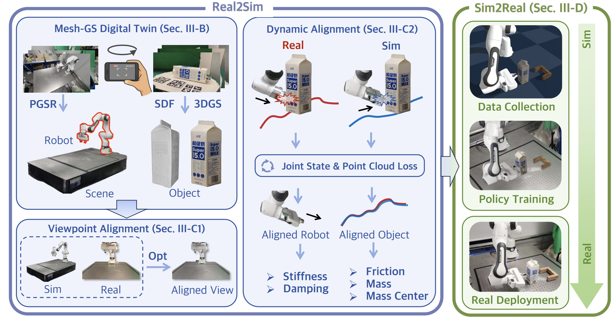

# TwinAligner: Visual-Dynamic Alignment Empowers Physics-aware Real2Sim2Real for Robotic Manipulation

  

    <a href="https://hwfan.io/about-me/">Hongwei Fan*</a>,
    <a href="https://daihangpku.github.io/">Hang Dai*</a>,
    <a href="https://jiyao06.github.io/">Jiyao Zhang*</a>,
    <a href="https://kingchou007.github.io/">Jinzhou Li</a>,
    <a href="https://qiyangyan.github.io/web/">Qiyang Yan</a>,
  

  

    <a href="https://github.com/ZhaoYujie2002">Yujie Zhao</a>,
    <a href="https://github.com/GasaiYU">Mingju Gao</a>,
    <a href="https://github.com/Happy-Boat">Jinghang Wu</a>,
    <a href="https://ha0tang.github.io/">Hao Tang</a>,
    <a href="https://zsdonghao.github.io/">Hao Dong</a>
  

  (* indicates equal contribution)

    

This repository contains the official implementation of [TwinAligner: Visual-Dynamic Alignment Empowers Physics-aware Real2Sim2Real for Robotic Manipulation](https://twin-aligner.github.io/).

Code is coming soon.